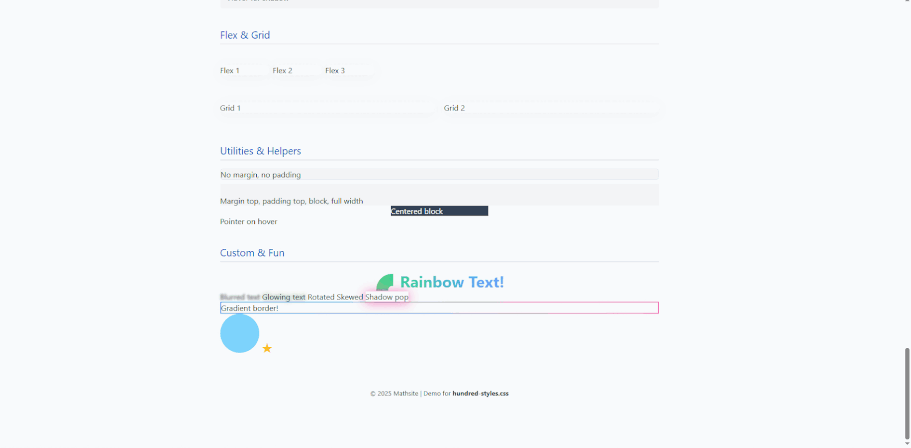

# hundred-styles.css

A demo and showcase of **100+ modern CSS utility and component styles** by [Mathsite](https://mathsite.github.io/me)!

This repository contains:
- [`hundred-styles.min.css`](hundred-styles.min.css) – a minified CSS file with 100 distinct styles, including utilities, buttons, cards, forms, animations, grids, and more.
- [`hundred-styles-demo.html`](index.html) – a ready-to-run HTML demo featuring and documenting all the styles in action.

## 🚀 Quick Start

1. **Clone or Download**
   ```bash
   git clone https://github.com/mathsite/hundred-styles.git
   ```
   Or [download the ZIP](https://github.com/mathsite/hundred-styles/archive/refs/heads/main.zip).

2. **Open the Demo**
   - Simply open `hundred-styles-demo.html` in your browser to explore and copy any styles you like!

3. **Add to Your Project**
   - Copy `hundred-styles.min.css` to your project, and include it in your HTML:
     ```html
     <link rel="stylesheet" href="hundred-styles.min.css">
     ```

## 🖌️ Features

- **Typography:** Beautiful headings, text utilities, and color classes.
- **Buttons:** Primary, secondary, outline, success, and more.
- **Cards & Containers:** Ready-to-use card and layout helpers.
- **Forms:** Styled inputs, labels, error/success states, and checkboxes.
- **Lists & Tables:** Stylish tables and list styles.
- **Images & Media:** Responsive images, avatars, circles, and media objects.
- **Animations:** Fade, slide, pop, hover effects, and transitions.
- **Layout:** Flexbox and Grid helpers.
- **Utilities:** Margin, padding, display, and width helpers.
- **Fun Custom Styles:** Rainbow text, blur, glow, gradient borders, and more.

## ✨ Demo Preview

Open [`hundred-styles-demo.html`](index.html) for a live preview, or see a sample below:



## 📂 File List

- `hundred-styles.min.css` – Minified CSS with 100+ styles
- `hundred-styles-demo.html` – Complete interactive demo
- `README.md` – This file

## 🧑‍💻 Author

**Matthew Sited** (aka [Mathsite](https://mathsite.github.io/me))  
CSS enthusiast and web design student.

Fun fact: I love making easy, modern, and creative CSS tools!

---

Enjoy!  
**Feel free to fork, star, or suggest new styles.**
